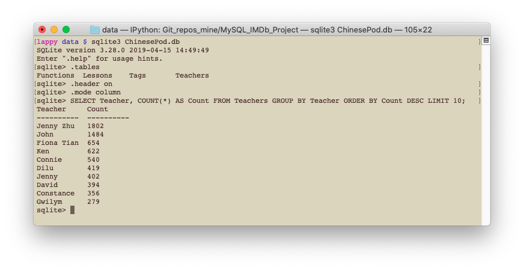

# ChinesePod SQLite Database Project

This jupyter notebook will read in the data scraped from the ChinesePod website which was obtained as part of my [ChinesePod Project](https://github.com/dlwhittenbury/ChinesePod_Project). The purpose of this project is for me to become more familiar with SQLite databases and their use with python. In this notebook we will

   - Clean and arrange the data into normalised dataframes/tables using the pandas library
   - Design a relational database to hold the data
   - Normalise the database
   - Create a SQLite database using python
   - Load data into the SQLite database using python
   - Query the SQLite database using python

SQLite was chosen over other database management systems, such as MySQL, because the size of the data is relatively small and the database structure is quite simple.

## An example query from SQLite terminal

Terminal screenshot of query Q1, Who are the 10 teachers that appeared in the most lessons?

